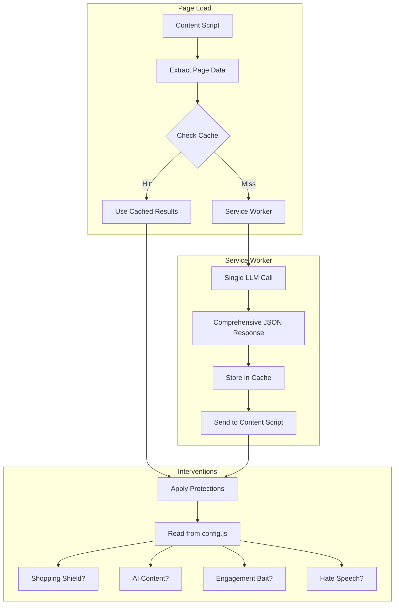

# TruthLens Refactoring Plan

## Overview

Refactor TruthLens to use a **single LLM scan** that returns comprehensive JSON metrics, which then drive all downstream protections. This simplifies the architecture, reduces API calls, and makes calibration easier.

---

## New Architecture



---

## Key Changes

### 1. Centralized Config File (`lib/config.js`)

Single file for all calibration settings:

```javascript
export const CONFIG = {
  // API Settings
  api: {
    provider: "claude", // "claude" | "gemini" | "openai"
    timeout: 15000,
    maxTextLength: 3000,
  },
  
  // Trust Score Thresholds (no base score)
  thresholds: {
    safe: 70,
    caution: 40,
    danger: 0,
  },
  
  // Feature Toggles & Sensitivity
  features: {
    impulseBuyShield: {
      enabled: true,
      delaySeconds: { low: 5, medium: 10, high: 15 },
      triggerPatterns: ["buy now", "add to cart", "checkout"],
    },
    rageBaitShield: {
      enabled: true,
      blurThreshold: 0.6, // LLM confidence threshold
    },
    hateSpeechFilter: {
      enabled: true,
      censorMode: "blur", // "blur" | "hide" | "highlight"
    },
    slopDetector: {
      enabled: true,
      confidenceThreshold: 0.5,
    },
    // ... other features
  },
  
  // Domain Analysis
  domain: {
    minAgeDays: 90, // Flag domains younger than this
    trustedDomains: ["google.com", "github.com", ...],
  },
};
```

### 2. Unified API Layer (`utils/api.js`)

Single entry point for any LLM provider:

```javascript
export async function analyzePage(pageData, apiKey, provider) {
  const prompt = buildUnifiedPrompt(pageData);
  
  switch (provider) {
    case "claude": return callClaude(prompt, apiKey);
    case "gemini": return callGemini(prompt, apiKey);
    case "openai": return callOpenAI(prompt, apiKey);
  }
}
```

### 3. Unified LLM Prompt → JSON Response

Single prompt that returns ALL metrics:

```json
{
  "pageType": "shopping",
  "trustScore": 65,
  
  "aiContent": {
    "detected": true,
    "confidence": 0.82,
    "reasoning": "Repetitive phrasing, generic structure"
  },
  
  "toxicity": {
    "hateSpeech": false,
    "rageBait": true,
    "rageBaitConfidence": 0.75,
    "inflammatorySections": [
      { "text": "You won't BELIEVE what...", "start": 245, "end": 280 }
    ]
  },
  
  "shopping": {
    "hasUrgencyTactics": true,
    "urgencyPhrases": ["Only 2 left!", "Deal ends today"],
    "hasPriceManipulation": false
  },
  
  "risks": [
    "New domain (45 days old)",
    "Urgency language detected",
    "Engagement bait headlines"
  ],
  
  "domainInfo": {
    "age": 45,
    "ssl": true,
    "safeBrowsing": "safe"
  }
}
```

### 4. Result Caching (`utils/cache.js`)

Cache LLM results by URL to avoid re-triggering:

```javascript
// Key: normalized URL (strip query params, fragments)
// Value: { result: JSON, timestamp: Date, ttl: 30min }

export async function getCachedResult(url) {
  const key = normalizeUrl(url);
  const { truthlens_cache } = await chrome.storage.local.get("truthlens_cache");
  const cached = truthlens_cache?.[key];
  
  if (cached && Date.now() - cached.timestamp < cached.ttl) {
    return cached.result;
  }
  return null;
}

export async function setCachedResult(url, result) {
  const key = normalizeUrl(url);
  const { truthlens_cache = {} } = await chrome.storage.local.get("truthlens_cache");
  
  truthlens_cache[key] = {
    result,
    timestamp: Date.now(),
    ttl: 30 * 60 * 1000, // 30 minutes
  };
  
  await chrome.storage.local.set({ truthlens_cache });
}
```

### 5. Fix SSL & Domain Age

Current issues:
- SSL check only looks at protocol, doesn't verify cert
- Domain age relies on external API that may fail silently

Fixes:
- SSL: Keep simple protocol check (HTTPS = valid for extension purposes)
- Domain age: Add better error handling, fallback messaging, and cache WHOIS results

### 6. Inflammatory Section Highlighting

Use LLM response `inflammatorySections` array to:
1. Find text nodes containing those sections
2. Wrap in `<span class="tl-inflammatory">` 
3. Apply CSS based on config: blur, highlight border, or hide

```css
.tl-inflammatory.blur { filter: blur(4px); }
.tl-inflammatory.highlight { background: rgba(255, 0, 0, 0.2); border-left: 3px solid red; }
.tl-inflammatory.hide { display: none; }
```

### 7. UI Updates

- Increase base font size in popup.css and content.css
- Use CSS custom properties for easy adjustment:

```css
:root {
  --tl-font-size-base: 16px;
  --tl-font-size-lg: 18px;
  --tl-font-size-xl: 22px;
}
```

---

## File Changes Summary

| File | Action | Description |
|------|--------|-------------|
| `lib/config.js` | **NEW** | Centralized calibration settings |
| `utils/cache.js` | **NEW** | LLM result caching |
| `utils/api.js` | **MODIFY** | Unify providers, single prompt |
| `background/service-worker.js` | **MODIFY** | Use cache, single LLM flow |
| `content/content.js` | **MODIFY** | Read config, apply inflammatory highlighting |
| `content/content.css` | **MODIFY** | Bigger text, inflammatory styles |
| `popup/popup.html` | **MODIFY** | Single API key input |
| `popup/popup.css` | **MODIFY** | Bigger text |
| `lib/heuristics.js` | **KEEP** | Fallback when no API key |

---

## New Flow

1. **Page loads** → Content script extracts page data
2. **Check cache** → If cached result exists and fresh, use it
3. **If cache miss** → Send to service worker
4. **Service worker** → Single LLM call with unified prompt
5. **LLM returns JSON** → Cache result, send to content script
6. **Content script** → Read `config.js`, apply relevant protections based on JSON metrics
7. **Page refresh/interaction** → Cache hit, no new API call

---

## Questions for Clarification

1. **Cache TTL**: 30 minutes default - is this appropriate?
2. **API key storage**: Keep in `chrome.storage.local` or move to `chrome.storage.sync`?
3. **Fallback behavior**: When no API key is set, should we use heuristics only or show a setup prompt?
4. **Inflammatory highlighting**: Prefer blur, highlight, or hide as default?
